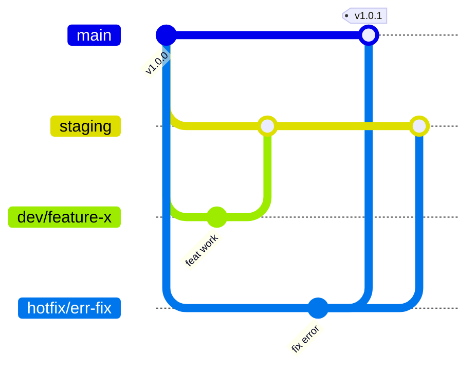

# Contributing to Paralux Extract App

Welcome to the **Paralux Extract App** codebase. To ensure high code quality, UI consistency, and clean project history, all contributors must follow the guidelines outlined below.

---

## 1. Branching Strategy

We follow a structured branching model to manage releases and prevent code integration clashes:



- **`main`**: Production-ready code. Directly corresponds to the live extraction app release. No direct commits are allowed here. Updates are merged from `staging` after thorough verification, or from `hotfix/*` branches for emergency patches.
- **`staging`**: Integration and pre-release branch. Used to test combined features in a staging environment. Direct commits should be kept to a minimum.
- **`dev/*` (Feature/Fix Branches)**: Developer workspaces (e.g. `dev/schema-builder`, `dev/pdf-preview`). All new features, style cleanups, and bug fixes must be developed in these isolated branches, then merged into `staging` via pull requests.
- **`hotfix/*` (Emergency Hotfixes)**: Created directly from `main` to address critical production issues. Once verified and compiled locally, the branch is merged directly back into `main` (generating a patch tag, e.g., `v1.0.1`) **and** merged back into `staging` to prevent code regression.

---

## 2. Code Quality & Local Verification

Before pushing any changes or merging a branch into `staging`, you **must** verify that the project builds locally without any compiler warnings or TypeScript errors.

Run the following validation commands in your local terminal:

### Frontend Compilation & Linting Check
Run this in the project root:
```bash
npm run build
npm run lint
```

---

## 3. Commit Guidelines (Conventional Commits)

We enforce the [Conventional Commits](https://www.conventionalcommits.org/) specification. Commit messages must be structured as follows:

```text
<type>(<scope>): <subject in imperative mood>

[body: details of what changed and why]
- Bullet point describing change A
- Bullet point describing change B
```

### Commit Types (`<type>`)
Must be one of the following:
- `feat`: A new feature or extraction studio addition.
- `fix`: A bug fix or runtime error repair.
- `style`: Layout, dark mode themes, or spacing adjustments that do not affect code logic.
- `refactor`: Restructuring code (neither fixing a bug nor adding a feature).
- `docs`: Documentation updates (like modifying this README or CONTRIBUTING file).
- `test`: Adding or updating test cases.
- `chore`: Auxiliary tasks, npm package updates, or build script tweaks.

### Common Project Scopes (`<scope>`)
- `extraction`: Document upload, extraction processing, and results preview.
- `schema`: Zod schema compilation, field definitions, and schema library.
- `ui`: Component layouts, modals, buttons, and theme styles.
- `api`: AI Cloud Function HTTP requests and error handling.
- `auth`: API key headers, session state, and permissions.
- `i18n`: Internationalization and translation strings.

### Subject Guidelines
- Use the **imperative, present tense** (e.g., `"add schema builder"` instead of `"added schema builder"`).
- Write the subject line in **lowercase** and **do not end with a period**.
- Keep the subject line under **50 characters**.

### Example Commit Message
```text
feat(schema): implement Zod schema compiler and dynamic field editor

- Add visual property editor for array and object types
- Enable raw JSON import and schema validation
- Integrate with Cloud Function extraction API
```

---

## 4. Integration Flow (Merging Changes)

1. Create your feature branch from the latest `staging` branch:
   ```bash
   git checkout staging
   git pull origin staging
   git checkout -b dev/my-awesome-feature
   ```
2. Develop changes, ensuring you write clean code and match theme variables.
3. Validate compiles by running local `npm run build` and `npm run lint`.
4. Commit your changes using Conventional Commit messages.
5. Push your feature branch and open a Pull Request into `staging`.
6. Once reviewed and tested, the branch is merged into `staging`.
7. Periodic production releases will merge `staging` into `main`.
