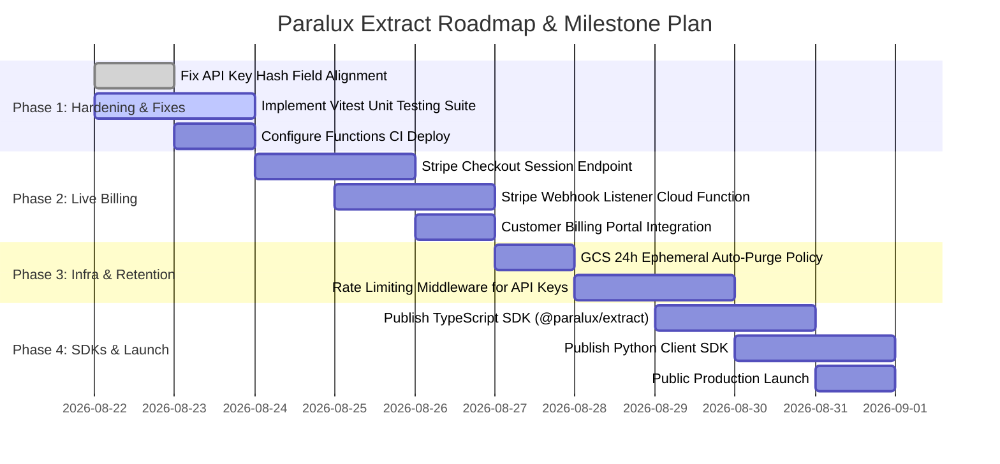

# Paralux Digital Extract — Project Objectives & Progress Roadmap

**Last Updated:** August 2026  
**Repository:** `paralux-digital/paralux-extract-app`  
**Current Branch:** `staging`  

---

## 📌 Executive Summary & Architecture Mental Model

**Paralux Digital Extract** is an enterprise-grade AI-powered structured document extraction platform. It bridges unstructured documents (PDF invoices, scanned receipts, medical charts, complex contracts) with strongly-typed JSON data pipelines through a credit-based, zero-token-complexity developer API.

### Core Value Proposition & Pricing Tiers
- **Sub-Second Low-Cost Extraction**: Plans starting at **$20/month (1,000 document credits)** or on-demand **Pay-As-You-Go (PAYG)** credit packs ($15 for 500, $25 for 1,000, $60 for 3,000).
- **Dual Intelligence Engines**:
  - **Mode 1 (Standard Extraction - 1 Credit / 5 pages)**: Powered by Gemini 3.5 Flash-Lite with zero-thought latency for invoices, receipts, and standard forms.
  - **Mode 2 (Advanced Multimodal - 2 Credits / 5 pages)**: Powered by Gemini 3.7 Flash with deep visual parsing for multi-page contracts, skewed scans, and dense multi-column financial tables.
- **Strict Privacy & Zero-Charge Guarantees**:
  - Raw AI token counts and internal model names are kept private server-side in `/usage_logs`.
  - 2-Phase transactional credit deduction guarantees **0 credits charged** if extraction fails.
  - 24-hour ephemeral document storage in Google Cloud Storage ($0.00 storage overhead).

---

## 📊 Overall Project Status Scorecard

| Pillar | Completion | Status | Summary |
|---|:---:|:---:|---|
| **Frontend UI & User Experience** | **95%** | 🟢 Complete | Dual-mode App (Landing + Authenticated Portal), Schema Workbench, API Key Manager, Telemetry Dashboard, ROI Calculator, Code Snippet Exporters, Auth Modals. |
| **Backend Cloud Functions Engine** | **90%** | 🟢 Complete | Standalone Node 22 ESM Cloud Functions (`extractionApi`), Zod validation, dynamic Gemini JSON schema normalization, 2-phase credit reservation/commit, webhook dispatcher, queue auto-resume trigger. |
| **Database & Firestore Security** | **95%** | 🟢 Complete | Multi-tenant collections (`/users`, `/api_keys`, `/usage_logs`, `/extraction_queue`), strict Firestore & Storage security rules with ownership validation and soft-revoke policies. |
| **Telemetry & Observability** | **90%** | 🟢 Complete | Server-side token tracking (prompt, candidate, thoughts, latency), aggregate metrics dashboard in UI, low-balance predictive runway alerts. |
| **CI/CD & DevOps** | **85%** | 🟡 Near Complete | GitHub Actions workflows for linting (Oxlint), building, Gitleaks secret scanning, and automated Firebase Hosting deployment. Cloud Functions auto-deploy step to be finalized. |
| **Billing & Payments (Stripe)** | **75%** | 🟡 In Progress | UI subscription and PAYG modals built with real-time balance increments in Firestore; production Stripe webhook integration pending. |
| **Automated Testing Suite** | **40%** | 🔴 Needs Attention | Strict TypeScript compilation and Oxlint lint checks are zero-warning clean; automated unit and integration tests (Vitest) need to be implemented. |

---

## 🧩 Detailed Feature Breakdown & Implementation Matrix

### 1. Frontend Client (`src/`)
- [x] **Dual Navigation State**: `NavigationContext` supporting switching between public landing pages and authenticated portal tabs (`workbench`, `keys`, `logs`, `docs`, `snippets`) with breadcrumb routing.
- [x] **Landing Page & Developer Showcase**:
  - **Hero Section**: Value proposition, plan summary highlights, CTA routing.
  - **Features Showcase**: Mode 1 vs Mode 2 comparison, engine capabilities.
  - **Pricing & ROI Calculator**: Interactive volume slider with real-time human manual cost baseline ($1.25/doc) vs Paralux monthly savings calculation.
  - **SDK Code Exporter**: Instant snippets for cURL, Node.js (with exponential backoff), Python, and Go.
  - **REST API Specs**: Interactive endpoint inspector for `/api/extract` with response previews for 200 OK, 202 Queued, and 402 Insufficient Balance.
- [x] **Developer User Portal**:
  - **Schema Workbench (`Playground.tsx`)**:
    - Preset templates (Invoices, Receipts, Resumes, Lease Agreements).
    - Visual schema builder supporting scalar fields and nested arrays of objects.
    - Raw JSON schema editor with bidirectional synchronization.
    - Text pasting and direct file upload (PDF, PNG, JPG, MD, TXT).
    - Client-side PDF page counter (`preflight.ts`) inspecting binary headers without canvas overhead.
    - Real-time preflight cost estimation cards with dynamic balance validation.
    - Visual and JSON formatted extraction output viewer with instant copy.
  - **API Keys Manager (`ApiKeysManager.tsx`)**:
    - Cryptographic key generation (`px_live_...`, `px_test_...`) with one-time plaintext modal reveal.
    - SHA-256 client-side hashing for secure Firestore storage.
    - Soft revocation flow without hard deletion.
    - Predictive runway calculation (Days remaining based on 7-day burn rate).
    - Low-balance alert settings (threshold value, alert email, webhook endpoint).
  - **Telemetry & Logs Manager (`UsageLogsManager.tsx`)**:
    - Real-time Firestore snapshot listener for `/usage_logs`.
    - Metric summary cards (Total Tokens, Prompt Tokens, Output Tokens, Latency, Credits).
    - Search by Extraction ID / Category and filtering by Extraction Mode.
    - Modal inspector for raw JSON audit records.
  - **Credit Top-up Modal (`CreditTopupModal.tsx`)**:
    - PAYG pack selector ($15 for 500, $25 for 1,000, $60 for 3,000 credits).
    - Instant balance top-up flow with success toast alerts.
- [x] **Authentication Flow (`AuthModal.tsx` & `AuthContext.tsx`)**:
  - Firebase Auth with Google OAuth Popup and Email/Password.
  - Automatic allocation of 50 free credits upon first sign-up.

### 2. Backend Cloud Functions (`functions/src/`)
- [x] **HTTPS Express API (`functions/src/index.ts` & `routes.ts`)**:
  - Single endpoint handling `/api/extract` and direct Cloud Functions invocation.
  - 50MB payload limit for base64 / large documents.
  - Health check endpoint `/health` and job polling endpoint `/api/jobs/:jobId`.
  - Structured error response formatting (`INVALID_SCHEMA`, `MISSING_DOCUMENT`, `INVALID_API_KEY`, `INSUFFICIENT_CREDITS`).
- [x] **Extraction Service (`service.ts`)**:
  - Direct integration with Gemini API via `@google/genai`.
  - Mode 1 (`gemini-3.5-flash-lite`) and Mode 2 (`gemini-3.7-flash`).
  - Zod validation and dynamic JSON Schema builder (`zodHelper.ts`).
  - Direct Google Cloud Storage ephemeral file downloader.
  - Exponential backoff retry handler for model rate limits.
  - Asynchronous webhook notification dispatcher (`dispatchWebhookResult`).
- [x] **Auth & Quota Management (`auth.ts`)**:
  - 2-Phase zero-charge transactional quota validation:
    - *Phase 1*: Verify API key / user profile and check available credits.
    - *Phase 2*: Deduct credits in Firestore transaction and write telemetry to `/usage_logs` strictly after successful inference.
  - Low-balance threshold detector and webhook alert dispatcher.
- [x] **Background Queue Trigger (`triggers/queueTrigger.ts`)**:
  - Event-driven Firestore `onDocumentUpdated` listener on `users/{userId}`.
  - Automatically resumes paused queue jobs (`paused_insufficient_credits`) in FIFO order when user adds credits.

### 3. Database, Storage & Security
- [x] **Firestore Security Rules (`firestore.rules`)**:
  - Multi-tenant isolation ensuring users can only read/write their own records (`request.auth.uid == userId`).
  - Read-only protection for `/usage_logs` and `/extraction_queue` (written only by Admin SDK).
  - Hard deletes blocked on `/api_keys` to enforce auditability.
- [x] **Cloud Storage Security Rules (`storage.rules`)**:
  - Ingestion bucket path `/ephemeral/{userId}/*` allowing uploads up to 25MB.
- [x] **Secret Scanning & Guardrails**:
  - GitHub Actions `gitleaks` secret scanner configured.
  - Zero hardcoded credentials in codebase; client reads from `import.meta.env` and backend reads from Firebase Secret Manager (`defineSecret('GEMINI_API_KEY')`).

---

## 🔍 Identified Gaps, Discrepancies & Technical Debt

1. **API Key Hash Field Discrepancy**:
   - In `src/services/firebase.ts` (line 183), generated keys are saved as `hashedKey: hashedKey`.
   - In `functions/src/auth.ts` (line 28), the backend queries `.where('keyHash', '==', hashed)`.
   - *Impact*: Direct API calls with `x-api-key` against Cloud Functions will fail to authenticate until this field name is unified.
2. **Cloud Functions CI/CD Deployment**:
   - `.github/workflows/ci.yml` currently compiles Cloud Functions (`npm run build:functions`) and deploys Firebase Hosting, but does not deploy Cloud Functions (`firebase deploy --only functions`).
3. **Live Stripe Payment Processing**:
   - The UI simulates credit purchases directly via client Firestore `increment()`. Production requires a secure server-side Stripe Checkout session and Stripe Webhook (`stripe-node`).
4. **Automated Ephemeral File Purging**:
   - Documents are stored in GCS under `/ephemeral/`, but a GCS Lifecycle policy rule (or a scheduled Cloud Function `pubsub.schedule`) needs to be active in GCP to delete files older than 24 hours.
5. **Unit & Integration Test Suite**:
   - There are currently no Vitest / Jest test suites to verify `preflight.ts`, `zodHelper.ts`, and endpoint contracts automatically.

---

## 🚀 Prioritized Roadmap & Action Plan ("What's Left")



### Phase 1: Engine Hardening & Bug Alignment (Immediate Priority)
- [ ] **Align API Key Schema**: Update `functions/src/auth.ts` and `src/services/firebase.ts` to support both `hashedKey` and `keyHash` (standardizing on `hashedKey` across all types).
- [ ] **Add Automated Unit Tests (`vitest`)**:
  - Test preflight calculations (page count, credit cost multipliers, balance checks).
  - Test Zod dynamic schema compilation and JSON Schema normalization.
  - Test 2-phase credit deduction logic with mock Firestore.
- [ ] **Add Cloud Functions Deploy to CI**: Update `.github/workflows/ci.yml` to deploy Cloud Functions upon merge to `staging` and `main`.

### Phase 2: Production Monetization & Stripe Webhooks
- [ ] **Stripe Checkout Backend**:
  - Add `createCheckoutSession` Cloud Function endpoint for PAYG packs and Subscription plans.
  - Add customer ID binding to Firestore `/users/{userId}`.
- [ ] **Stripe Webhook Listener**:
  - Endpoint `/stripe/webhook` validating Stripe event signatures.
  - Handle `checkout.session.completed` (add credits atomically via `commitCreditDeduction` / transaction).
  - Handle `customer.subscription.deleted` and renewal events.
- [ ] **Stripe Customer Portal**: Link from portal navbar to manage subscriptions.

### Phase 3: Infrastructure Lifecycle & Rate Limiting
- [ ] **24-Hour GCS Auto-Purge**:
  - Configure GCP Cloud Storage Lifecycle Rule (`Age: 1 day` on `ephemeral/` prefix) or deploy a daily scheduled function `purgeExpiredEphemeralDocs`.
- [ ] **Token Bucket Rate Limiting**:
  - Implement memory or Firestore rate limiter respecting `rateLimitRpm` on active API keys (returning `429 Too Many Requests` with `Retry-After` header).

### Phase 4: Developer Ecosystem & Public Launch
- [ ] **Official SDKs**:
  - Publish `@paralux/extract` on npm (TypeScript / Node).
  - Publish `paralux-extract` on PyPI (Python).
- [ ] **HMAC-SHA256 Webhook Signatures**:
  - Include `x-paralux-signature` header in webhook dispatches so developers can verify payload authenticity.
- [ ] **End-to-End Staging Verification & Production Cutover**:
  - Run full test extractions against staging environment.
  - Merge verified `staging` to `main`.

---

## 🎯 Verification & Quality Checklist

Before closing any milestone:
```bash
npm run lint             # Oxlint fast check (0 warnings, 0 errors)
npm run build            # Frontend Vite + TypeScript bundle check
npm run build:functions  # Cloud Functions TypeScript compilation
```
