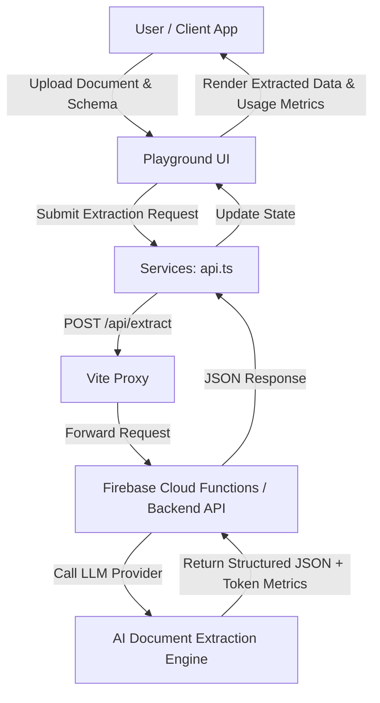

# Paralux Extract App

An enterprise-grade SaaS platform and interactive web sandbox for automated AI document data extraction powered by React 19, Vite, TypeScript, and Tailwind CSS.

---

## 🎯 Objective

**Paralux Extract** is designed to simplify and automate the process of extracting structured, validated JSON data from unstructured or semi-structured documents (e.g., invoices, receipts, contracts, legal agreements, and PDFs).

### Key Goals:
1. **Interactive Sandbox**: Provide developers and enterprise clients with a live playground to test document extraction using custom JSON schemas and multiple AI models.
2. **Flexible Document Ingestion**: Support sample documents, file uploads (PDF, images), and raw base64 data streams.
3. **Transparent Usage & Cost Analytics**: Compute real-time token metrics (prompt, candidate, thought tokens) and calculate provider costs vs client pricing tiers ($20, $50, $200, $500/mo).
4. **Developer Empowerment**: Offer an interactive pricing calculator, auto-generated multi-language code export snippets (cURL, Python, Node.js, Go), and comprehensive API documentation.

---

## ⚙️ How It Works



### 1. Document Ingestion & Schema Definition
* Users can select pre-built sample templates (Invoice, Receipt, Contract) or upload custom PDF/image files.
* Users define a target JSON schema specifying expected fields (`string`, `number`, `boolean`, `array`, `object`), descriptions, and required constraints.

### 2. Model Selection & API Communication
* The application supports selecting from different AI models (e.g., Gemini Flash, Gemini Pro, Lite models).
* The request payload containing the document data and schema is dispatched via [`src/services/api.ts`](file:///Users/janvalentin/Git/paralux-digital/paralux-extract-app/src/services/api.ts).
* The Vite dev server proxies `/api/extract` requests to the local or production Firebase Cloud Function backend (`http://127.0.0.1:5001/paralux-digital/us-central1/extractionApi/extract`). If proxying fails, it gracefully attempts a fallback directly to the backend endpoint.

### 3. Response Parsing & Usage Metrics
* Upon successful extraction, the backend returns the extracted JSON along with token usage statistics (`promptTokens`, `candidatesTokens`, `thoughtsTokens`, `totalTokens`, `executionTimeMs`).
* The UI calculates financial metrics based on model rates:
  * **Provider Cost (USD)**: Raw API cost from the model provider.
  * **Client Price (USD)**: Price charged to the end user based on active pricing tiers and markup multipliers.

### 4. Developer Tools & Integration
* **Pricing Calculator**: Dynamically projects monthly document volumes, token usage, margins, and plan suitability ($20 Starter, $50 Growth, $200 Scale, $500 Enterprise).
* **Code Exporter**: Generates instant integration code snippets for cURL, Python, Node.js, and Go.
* **API Documentation**: Provides clear specifications on request schemas, headers (`x-user-id`, `x-api-key`), and response structures.

---

## 📁 Project Structure

```
paralux-extract-app/
├── index.html              # Main HTML entry point
├── package.json            # Project dependencies, scripts, and package metadata
├── README.md               # Project documentation (this file)
├── tsconfig.json           # Root TypeScript configuration
├── tsconfig.app.json       # TypeScript config for application source files
├── tsconfig.node.json      # TypeScript config for Node/Vite scripts
├── vite.config.ts          # Vite configuration & proxy settings for API routes
├── .oxlintrc.json          # Oxlint linter rules configuration
├── public/                 # Static public assets
└── src/
    ├── App.tsx             # Root React component & main layout container
    ├── App.css             # Global layout & app custom styles
    ├── index.css           # Tailwind CSS directives & theme setup
    ├── main.tsx            # React application entry point (ReactDOM rendering)
    ├── assets/             # Images, logos, and visual assets
    ├── components/         # Modular UI components
    │   ├── Navbar.tsx            # Top navigation bar with section links & branding
    │   ├── Hero.tsx              # Landing hero section showcasing value proposition & tiers
    │   ├── Playground.tsx        # Main interactive extraction sandbox & schema builder
    │   ├── PricingCalculator.tsx # Interactive subscription tier & cost margin calculator
    │   ├── CodeExporter.tsx      # Multi-language code snippet generator
    │   ├── ApiDocs.tsx           # REST API endpoint documentation & schema guide
    │   └── Footer.tsx            # Page footer with links and copyright
    ├── services/           # Service layer for external APIs
    │   └── api.ts                # HTTP client for document extraction API with fallback logic
    └── types/              # TypeScript type definitions
        └── extraction.ts         # Types for schemas, responses, model options, and metrics
```

### Component Breakdown

| Component / Module | Path | Description |
| :--- | :--- | :--- |
| **`App.tsx`** | [`src/App.tsx`](file:///Users/janvalentin/Git/paralux-digital/paralux-extract-app/src/App.tsx) | Coordinates navigation tabs and renders sections (Hero, Playground, Pricing, Code Exporter, Docs, Footer). |
| **`Playground.tsx`** | [`src/components/Playground.tsx`](file:///Users/janvalentin/Git/paralux-digital/paralux-extract-app/src/components/Playground.tsx) | Core interactive sandbox for uploading files, building schemas, choosing models, and viewing extracted JSON & token metrics. |
| **`PricingCalculator.tsx`** | [`src/components/PricingCalculator.tsx`](file:///Users/janvalentin/Git/paralux-digital/paralux-extract-app/src/components/PricingCalculator.tsx) | Interactive tool to estimate monthly extraction costs, token usage, markup margins, and subscription tier recommendations. |
| **`CodeExporter.tsx`** | [`src/components/CodeExporter.tsx`](file:///Users/janvalentin/Git/paralux-digital/paralux-extract-app/src/components/CodeExporter.tsx) | Generates ready-to-run API request code snippets in cURL, Python, Node.js, and Go. |
| **`ApiDocs.tsx`** | [`src/components/ApiDocs.tsx`](file:///Users/janvalentin/Git/paralux-digital/paralux-extract-app/src/components/ApiDocs.tsx) | Formatted REST API specifications detailing endpoints, headers, payloads, and error codes. |
| **`api.ts`** | [`src/services/api.ts`](file:///Users/janvalentin/Git/paralux-digital/paralux-extract-app/src/services/api.ts) | Service responsible for dispatching extraction requests to `/api/extract` with automatic fallback to local Cloud Functions. |
| **`extraction.ts`** | [`src/types/extraction.ts`](file:///Users/janvalentin/Git/paralux-digital/paralux-extract-app/src/types/extraction.ts) | Data contracts for schemas, usage metrics, model configurations, and API payloads. |

---

## 🚀 Getting Started

### Prerequisites
* **Node.js**: v18+ recommended
* **npm**: v9+

### Installation & Running Locally

1. **Install Dependencies**:
   ```bash
   npm install
   ```

2. **Start Development Server**:
   ```bash
   npm run dev
   ```
   The app will run at `http://localhost:5174` with hot module replacement (HMR).

3. **Build for Production**:
   ```bash
   npm run build
   ```

4. **Lint Codebase**:
   ```bash
   npm run lint
   ```

---

## 🛠 Tech Stack

* **Frontend Framework**: [React 19](https://react.dev/)
* **Build Tool & Dev Server**: [Vite 8](https://vite.dev/)
* **Type System**: [TypeScript 6](https://www.typescriptlang.org/)
* **Styling**: [Tailwind CSS v4](https://tailwindcss.com/)
* **Linter**: [Oxlint](https://oxc.rs/)
